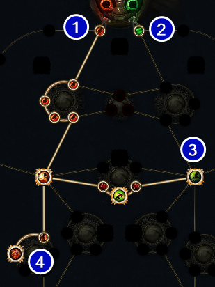
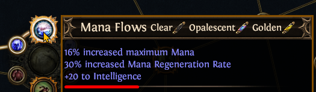
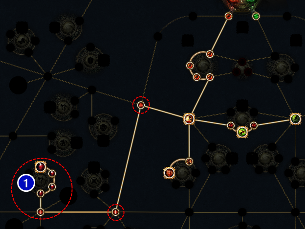
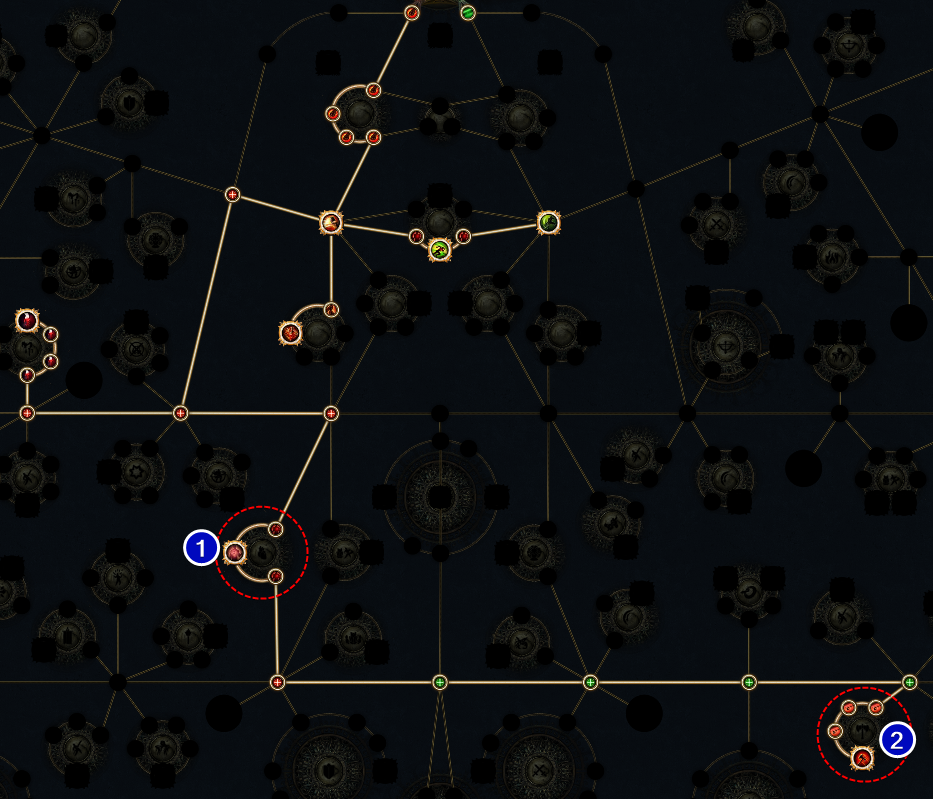

<div class="container">
<nav class="sidenav" id="nav-placeholder"></nav>
<main class="content-wrapper">
<div class="content-inner">
<article>

# 3.28 [Gladiator] Sunder Bleed Leveling
Updated: Feb 17, 2026

<div class="note-block">
<ul class="custom-list bullet-list">

- This guide is a leveling guide for basic Sunder Bleed Glad with the intent of swapping into CWS Glad for GGG Ultimatums.
</ul>
</div>

## <span id="pob"></span>POB Links

<ul class="custom-list bullet-list">

- 3.27 Guide POB: <a href="#">This Guide</a></a>

</ul>

---

## <span id="regex"></span>REGEX
<div class="code-container">
    <div class="code-header">
        <span>Gear Regex - works for full campaign</span>
        <button class="copy-btn" onclick="copyCode(this)">Copy</button>
    </div>

```-\w-.-|r-r-r|g-g-r|g-r-g|r-g-g|Runn|rint|s:.+ax```

</div>

<div class="code-container">
    <div class="code-header">
        <span>Gem Regex (Nessa)</span>
        <button class="copy-btn" onclick="copyCode(this)">Copy</button>
    </div>

```"lapis|Frostblink|sunder$|ida|^spectral throw$"```

</div>

---

## <span id="a1"></span>ACT 1 PROGRESSION
### End of Act 1: 20-23 mins - Level 12


<ul class="custom-list bullet-list">

- Starting Gems: [Double Strike](gemgreen)+[Chance to Bleed](gemred)
- 
</ul>
<div class="note-block">
<ul class="custom-list bullet-list">

- Starting Weapon: Keep the <a href="g">G</a>+<a href="r">R</a> sword on offhand to use for [Shield Charge](gemred)+[Momentum](gemgreen). Goal is to have this ready in Submerged Passage.
- Your weapon swap should be a 2H axe. You will be weapon swapping to traverse and damage until you get [Leap Slam](gemred)after Brutus (level 10).
 
</ul>
</div>

### Tarkleigh
<ul class="checklist">

- [ ] Buy [Spectral Throw](gemgreen)  *this will be your main skill for all of Act 1*
- [ ] Buy any [G](gemgreen)+[R](gemred)linked
- [ ] Pick up any shield and put it on off-hand for [Shield Charge](gemred) at level 4 

</ul>

### Hailrake
 

<ul class="checklist">

- [ ] Get [Quicksilver](gemgrey)
- [ ] Get [Momentum](gemgreen)or[Ruthless](gemred)
- I typically get [Momentum](gemgreen)and buy [Rutless](gemred) if I find RRR links
- [ ] Get [Shield Charge](gemred)
- [ ] Buy [Lapis Amulet](gemgrey) 
- You can take Mana Flows notable if you don't find [Lapis Amulet](gemgrey) to enable [Frostblink](gemblue)
- [ ] Buy [Frostblink](gemblue)
  
</ul>

### Dweller
<ul class="checklist">

- [ ] Get [Faster Attacks](gemgreen)

</ul>

### Brutus
<ul class="checklist">

- [ ] Get [Leap Slam](gemred)
- [ ] Buy [Intimidating Cry](gemred)

</ul>

### Fairgraves (Enter Caverns)
<ul class="checklist">

- [ ] Buy [Sunder](gemred)

</ul>

<div class="link-block" id="a1links">
<ul class="checklist">

### Level 1-11: Use Spectral Throw

- [ ] Link 1: [Spectral Throw](gemgreen)+[Chance to Bleed](gemred)+[Ruthless](gemred) or [Momentum](gemgreen)
- [ ] Link 2: [Shield Charge](gemred)+[Momentum](gemred)

### Level 10: Replace Shield Charge with Leap Slam
- [ ] Link 2: [Leap Slam](gemred)+[Momentum](gemgreen)

### Level 12: Mervail
- [ ] Link 1: [Sunder](gemred)+[Chance to Bleed](gemred)+[Ruthless](gemred) or [Faster Attacks](gemgreen)
- [ ] Link 2: [Shield Charge](gemred)+[Momentum](gemgreen)+[Faster Attacks](gemgreen)
- [ ] Util: [Frostblink](gemblue), [Blood & Sand](gemred), [Intimidating Cry](gemred)

Total Cost: 3 Transmute, 3+ Wisdoms
</ul>
</div>

---

## <span id="a2"></span>ACT 2 PROGRESSION
### End of Act 2: 38-40 mins, Level 20



 ### Fidelitas
 <ul class="checklist">
 
 - [ ] Get [Herald of Ash](gemred)
 - [ ] Buy [Blood Rage](gemgreen)
 - [ ] Buy [Herald of Purity](gemred)
 - [ ] Buy [Lapis Amulet](gemgrey)3x
 </ul>

### Weaver
 <ul class="checklist">

- [ ] Get [Melee Physical](gemred)
 </ul>

<div class="link-block" id="a2links">
<ul class="checklist">

- [ ] Link 1: [Sunder](gemred)+[Chance to Bleed](gemred)+[Melee Physical](gemred) or [Faster Attacks](gemgreen)
- [ ] Link 2: [Leap Slam](gemred)+[Faster Attacks](gemgreen)+[Momentum](gemgreen)
- [ ] Aura: [Herald of Ash](gemred),[Herald of Purity](gemred)
- [ ] Util: [Frostblink](gemblue), [Intimidating Cry](gemred), [Blood Rage](gemgreen)

Total Cost: 2 Alterations , 3 Wisdoms 

</ul>
</div>

---

## <span id="a3"></span>ACT 3 PROGRESSION
### End of Act 3: 55-60 mins, Level 28-30



<div class="note-block">
You can gamble at <a href="npc">Maramoa</a> at level 24 for 4 Links. Focus on armor since it's used for a longer time than weapons which you should always be upgrading. <a href="important">DO NOT OVER SPEND</a> as you will need gold later to respec to RF in Act 9
<ul class="custom-list bullet-list">

- 2H Axe / body armor: 145 gold each
- Gloves / Helmet / Boots: 135 gold each <a href="important"> < BETTER OPTION</a>

</ul>

</div>

### Piety
<ul class="checklist">

- [ ] Get [Pride](gemred)
- [ ] Buy [Vulnerability](gemred)
- [ ] Buy [Haste](gemgreen) or [Purity of Elements](gemblue)
  - Buy either gem based on if you want to go fast or have better survivability, you'll need to have INT or DEX based on which you pick.

</ul>

<div class="link-block" id="a3links">
<ul class="checklist">

- [ ] Link 1: [Sunder](gemred)+[Chance to Bleed](gemred)+[Melee Physical](gemred)+[Cruelty](gemred) or [Faster Attacks](gemgreen)
- [ ] Link 2: [Leap Slam](gemred)+[Faster Attacks](gemgreen)+[Momentum](gemgreen)
- [ ] Aura: [Herald of Ash](gemred),[Haste](gemgreen)
- [ ] Util: [Frostblink](gemblue), [Intimidating Cry](gemred), [Blood Rage](gemgreen), [Vulnerability](gemred)

Total Cost: 2 Alterations 

</ul>
</div>

---

## <span id="a4"></span>ACT 4 PROGRESSION
### End of Act 4: 1h20, Level 35


<div class="note-block">
<ul class="custom-list bullet-list">

- Do Normal Lab once you reach <a href="npc">Crystal Veins</a> waypoint
- Take Gladiator - <a href="npc">Gratuitous Violence</a> for first ascendancy

</ul>
</div>

### Malachai
<ul class="checklist">

- [ ] Get [Fist of War](gemred) replace [Cruelty](gemred) or [Close Combat](gemgreen)

</ul>

<div class="link-block" id="a4links">
<ul class="checklist">

- [ ] Link 1: [Sunder](gemred)+[Chance to Bleed](gemred)+[Melee Physical/Cruelty](gemred)+[Fist of War](gemred)
- [ ] Link 2: [Leap Slam](gemred)+[Faster Attacks](gemgreen)+[Momentum](gemgreen)
- [ ] Aura: [Herald of Ash](gemred)
- [ ] Util: [Frostblink](gemblue), [Blood & Sand](gemred), [Intimidating Cry](gemred), [Blood Rage](gemgreen), [Vulnerability](gemred)

Total Cost: None
</ul>
</div>

---


</ul>
<footer class="main-footer">
<div class="footer-content">
    <div class="footer-left">
        <p>&copy; 2026 Muzaroni Archive</p>
        <p class="footer-subtext">is not affiliated with or endorsed by Grinding Gear Games.</p>
    </div>
    <div class="footer-right">
        <a href="#" id="back-to-top">Back to Top ↑</a>
        <a href="https://pathofexile.com" target="_blank">Official PoE</a>
    </div>
</div>
</footer>
</div>
</article>
<aside class="toc-container">
    <nav class="toc">
        <h4>On This Page</h4>
        <ul>
            <li><a href="#">#</a>ACT 1</li>
            <li class="sub-item"><a href="#">A1 Links</a></li>
            <li><a href="#">#</a>ACT 2</li>
        </ul>
    </nav>
</aside>
</div>
</div>
</main>
</div>

<link rel="stylesheet" href="style.css">
<script src="script.js"></script>