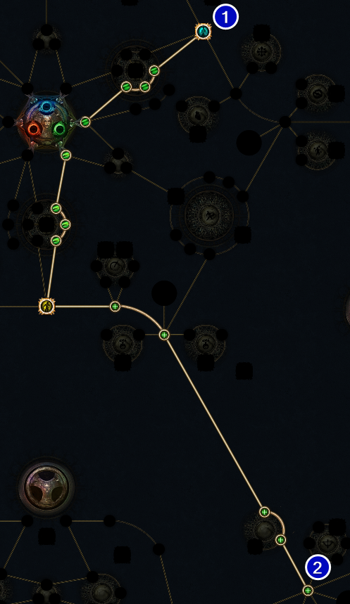
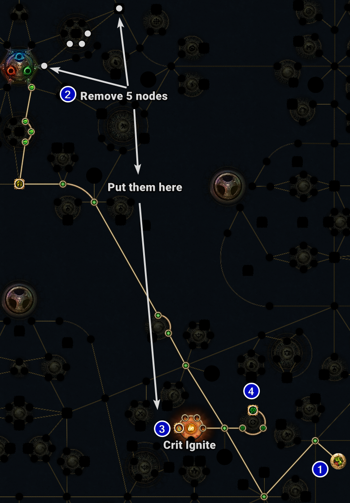
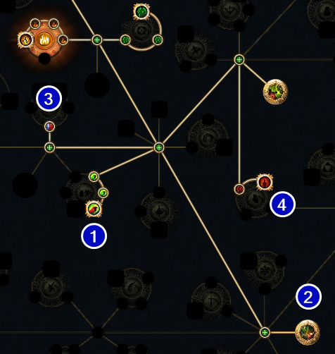

<div class="container">
<nav class="sidenav" id="nav-placeholder"></nav>
<main class="content-wrapper">
<div class="content-inner">
<article>
<!-- START OF MAIN CONTENT -->

# 3.29 [Scion] EConc Leveling for Aurabot Swap
Updated: June 26, 2026

<div class="note-block">
<ul class="custom-list bullet-list">

- This guide adapts <a href="https://www.youtube.com/watch?v=Y5DxnDJhFMo">Havoc's Leveling VOD</a> with the intention of getting to yellow maps then hard swapping to Aurabot.
  
</ul>
</div>

## <span id="pob"></span>POB Links

<ul class="custom-list bullet-list">

- <a href="r">3.29 Guide POB</a>: <a href="https://pobb.in/#">This Guide</a> <a href="r"> USE THIS</a>
- https://poelevellingplanner.com/build/?id=99196803667068550539
  
</ul>

---

## <span id="regex"></span>REGEX
<div class="code-container">
    <div class="code-header">
        <span>Gear Regex - works for full campaign</span>
        <button class="copy-btn" onclick="copyCode(this)">Copy</button>
    </div>

```-[rgb]-.-|g-g-[gr]|g-g|g-r|r-g|nne|rint|buckler|corroded```

</div>

---

## <span id="a1"></span>ACT 1 PROGRESSION



<ul class="custom-list bullet-list">

- Starting Gems: [Spectral Throw](gemgreen)+[Prismatic Burst](gemblue)
- To make transition into Act 2 smooth, try to have <a href="g">G</a><a href="g">G</a><a href="g">G</a> & <a href="g">G</a><a href="g">G</a><a href="r">R</a> by level 12 (end of Act 1)
</ul>

<div class="note-block">
<ul class="custom-list bullet-list">

- Below are all breakpoints by monster, after each name go to town and get the items listed.
  
</ul>
</div>

### Tarkleigh
<ul class="checklist">

- [ ] Get [Splitting Steel](gemgreen)(right gem) → Replace [Spectral Throw](gemgreen) for Mud Flats ONLY
- Do not discard&nbsp;[Spectral Throw](gemgreen)
- [ ] Buy [Corroded Blade](gemgrey)
- [ ] Buy shield, ideally with&nbsp;<a href="g">G</a><a href="r">R</a>&nbsp;link for [Shield Charge](gemred)+[Faster Attacks](gemgreen)
</ul>

### Hailrake
<ul class="checklist">

- [ ] Get [Quicksilver](trial)
- [ ] Look for links (see below) for options.&nbsp;<a href="g">G</a><a href="g">G</a><a href="r">R</a>&nbsp;feels best, but&nbsp;<a href="g">G</a><a href="g">G</a><a href="g">G</a>&nbsp;sets you up till Act 3
- <a href="g">G</a><a href="g">G</a><a href="r">R</a> = [Spectral Throw](gemgreen)+[Chance to Bleed](gemred)+[Volley](gemgreen) or [Momentum](gemgreen)
- <a href="g">G</a><a href="g">G</a><a href="b">B</a> = [Spectral Throw](gemgreen)+[Prismatic Burst](gemblue)+[Volley](gemgreen) or [Momentum](gemgreen)
- <a href="g">G</a><a href="b">B</a><a href="r">R</a> = [Spectral Throw](gemgreen)+[Prismatic Burst](gemblue)+[Chance to Bleed](gemred)
- <a href="g">G</a><a href="g">G</a><a href="g">G</a> = [Spectral Throw](gemgreen)+[Volley](gemgreen)+[Momentum](gemgreen)
- [ ] Buy [Amber Amulet / Iron Ring](gemgrey) 3x 
- [ ] Get [Volley](gemgreen)
 
</ul>

### Dweller
<ul class="checklist">

- [ ] Get [Decoy Totem](gemred)
- [ ] Buy [Frostblink](gemblue) 
- [ ] Buy [Sniper's Mark](gemgreen)
- [ ] Buy [Momentum](gemgreen) or [Chance to Bleed](gemred)
- Buy the other gem you didn't get earlier
  
</ul>

### Brutus
<ul class="checklist">

- [ ] Get [Faster Attacks](gemgreen)
- [ ] Get [Withering Step](gemgreen)
- [ ] Buy [Amber Amulet / Heavy Belt](gemgrey) 3x 

</ul>

### Fairgraves (Enter Caverns)
<ul class="checklist">

- [ ] Get [Poisonous Concoction](gemgreen)

</ul>

<div class="link-block" id="a1links">
<ul class="checklist">

### Level 1-11: Use Spectral Throw
- [ ] Link 1: [Spectral Throw](gemgreen)+[Volley](gemgreen)+[Chance to Bleed](gemred)
- [ ] Link 2: [Sheild Charge](gemred)+[Faster Attacks](gemgreen)+[Momentum](gemgreen)
- [ ] Aura: [Precision (1)](gemgreen)
- [ ] Util: [Frostblink](gemblue), [Withering Step](gemgreen), [Sniper's Mark](gemgreen)
### Level 12: Swap to Poisonous Concoction
- [ ] Link 1: [Poisonous Concoction](gemgreen)+[Volley](gemgreen)+[Momentum](gemgreen)

Total Cost: 5+ Wisdoms
</ul>
</div>

---
## <span id="a2"></span>ACT 2 PROGRESSION


### Fidelitas
<ul class="checklist">
 
- [ ] Get [Herald of Ash](gemred)
- [ ] Buy [Blood Rage](gemgreen)
- [ ] Buy [Amber Amulet / Heavy Belt](gemgrey) 3x 
</ul>

### Weaver
<ul class="checklist">

- [ ] Get [Elemental Damage with Attacks](gemred)
</ul>

### Bandits: Alira
<ul class="checklist">

- [ ] Buy [Lesser Multiple Projectiles](gemgreen) from Act 1, level off hand

</ul>

<div class="link-block" id="a2links">
<ul class="checklist">

- [ ] Link 1: [Poisonous Concoction](gemgreen)+[Volley](gemgreen)+[LMP](gemgreen) or [EDWA](gemred)
- [ ] Link 2: [Sheild Charge](gemred)+[Faster Attacks](gemgreen)+[Momentum](gemgreen)
- [ ] Aura: [Precision (1)](gemgreen), [Herald of Ash](gemred)
- [ ] Util: [Frostblink](gemblue), [Withering Step](gemgreen), [Sniper's Mark](gemgreen), [Blood Rage](gemgreen)

Total Cost: 1 Alteration , 3 Wisdoms 
</ul>
</div>

---
## <span id="a3"></span>ACT 3 PROGRESSION



---
<footer class="main-footer">
<div class="footer-content">
    <div class="footer-left">
        <p>&copy; 2026 Muzaroni Archive</p>
        <p class="footer-subtext">is not affiliated with or endorsed by Grinding Gear Games.</p>
    </div>
    <div class="footer-right">
        <a href="#" id="back-to-top">Back to Top ↑</a>
        <a href="https://pathofexile.com" target="_blank">Official PoE</a>
    </div>
</div>
</footer>
</div>
</article>
<aside class="toc-container">
    <nav class="toc">
        <h4>On This Page</h4>
        <ul>
            <li><a href="#pob">POB LINKS</a></li>
            <li><a href="#regex">REGEX</a></li>
            <li><a href="#a1">ACT 1</a></li>
            <li class="sub-item"><a href="#a1links">A1 Links</a></li>
            <li><a href="#a2">ACT 2</a></li>
            <li class="sub-item"><a href="#a2links">A2 Links</a></li>
            <li><a href="#a3">ACT 3</a></li>
            <li class="sub-item"><a href="#a3links">A3 Links</a></li>
            <li><a href="#a4">ACT 4</a></li>
            <li class="sub-item"><a href="#a4links">A4 Links</a></li>
            <li><a href="#a5">ACT 5</a></li>
            <li class="sub-item"><a href="#a5links">A5 Links</a></li>
            <li><a href="#a6">ACT 6</a></li>
            <li class="sub-item"><a href="#a6links">Gems to buy in A6</a></li>
            <li><a href="#a7">ACT 7</a></li>
            <li><a href="#a8">ACT 8</a></li>
            <li><a href="#rfheist">HEIST</a></li>
            <li><a href="#rfmap">MAPPING</a></li>
        </ul>
    </nav>
</aside>
<!-- DONT TOUCH BELOW -->
</div>
</div>
</main>
</div>

<link rel="stylesheet" href="style.css">
<script src="script.js"></script>