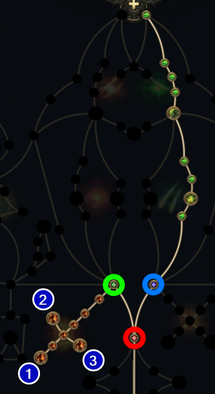
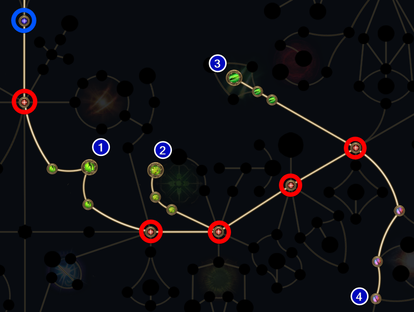

<div class="container">
    <nav class="sidenav" id="nav-placeholder"></nav>
    <main class="content-wrapper">
        <div class="content-inner">
            <article>
<!-- START OF MAIN CONTENT -->

# 0.5 [Witchhunter] Permafrost Bolts Leveling - Pohx
Updated: May 05, 2026

<div class="note-block">
<ul class="custom-list bullet-list">

- This guide is campaign specific rewrite of <a href="https://mobalytics.gg/poe-2/builds/pohx-shatter-tactician">Pohx's 0.4 SSF Witchhunter guide</a> using my own format.
  
</ul>
</div>

## <span id="pob"></span>RESOURCES

<ul class="custom-list bullet-list">

- <a href="#">POBB.in</a> not updated yet
- <a href="https://www.filterblade.xyz/?profile=muzaroni&saveState=75FSRY1PSN6A6F&isPreset=false&game=Poe2">FilterBlade</a> WIP
---

## <span id="regex"></span>REGEX
<div class="code-container">
    <div class="code-header">
        <span>Gear Regex - early campaign</span>
        <button class="copy-btn" onclick="copyCode(this)">Copy</button>
    </div>

```"y: r|ph.*da|^\+.*ills$|\d.+life|movem|s: cr"```

</div>
</ul>

---

## <span id="a1"></span>ACT 1 PROGRESSION

<div class="imp-block">
Weapon swapping is very important for this build. As soon as you pick up Permafrost Bolts in town, lock your weapon to both sets by right-clicking the Weapon Set 1 indicator. Once locked, set <a href="g">Permafrost Bolts</a> to Set 1 and <a href="g">Fragmentation Round</a> to Set 2. Now set Permafrost in hotkey > click the hotkey to "load" > click hotkey and select Crossbow Shot I. In another hotkey click on Fragmentation > click the hotkey to "load" > click on Crossbow Shot 2. This allows you to click the two skills in sequence saving you a button press.
</div>

<ul class="checklist">

### Gem upgrade order
[Permafrost Bolts](gemgreen) > [Fragmentation Rounds](gemgreen) > [Explosive Rounds](gemred)
<br></br>

### Gemcutting order
[Ice Bite I](gemblue) > 2 x [Elemental Armament I](gemred) > [Concentrated Area](gemblue) > [Magnified Area I](gemblue) > [Elemental Armament I](gemred)
<br></br>

### Progression
- [ ] Talk to Renly > Uncut Skill > [Permafrost Bolts](gemgreen)
- [ ] Abandoned Camp > Uncut Skill > [Explosive Grenades](gemred)
- [ ] Mud Burrows > Uncut Support 1 > [Ice Bite I](gemblue) put into [Permafrost Bolts](gemgreen)
- [ ] Areagne Witch > Uncut Support 1 > [Elemental Armament I](gemred) put into [Fragmentation Rounds](gemgreen)
- [ ] Red Vale > click "Refined Arms" for Tense Crossbow
- [ ] Rotten Druid > Uncut Support 1 > [Elemental Armament I](gemred) put into [Permafrost Bolts](gemgrey)
- [ ] Hunting Ground > Uncut Support 1 > [Concentrated Area](gemblue)
- [ ] Tomb of Consort Rare > Uncut Support 1 > Use later check below
- [ ] Level 10 try to get Sturdy Crossbow base
- [ ] King of the Mist > Uncut Spirit 1 > [Herald of Ice](gemblue)
- Uncut Support 1 > [Magnified Area I](gemblue)
- Uncut Support 1 > [Elemental Armament I](gemred)

</ul>

<div class="link-block" id="#a1links">
<ul class="checklist">

### Level 1-14
- [ ] Permafrost Bolts: [Ice Bite I](gemblue)+[Elemental Armament I](gemred)
- [ ] Fragmentation Rounds: [Elemental Armament I](gemred)+[Concentrated Area](gemblue)
- [ ] Herald of Ice: [Magnified Area I](gemblue)+[Elemental Armament I](gemred)
- [ ] Explosive Grenade: [Multishot I](gemgreen)+[Magnified Area I](gemblue)

</ul>
</div>

---
## <span id="a2"></span>ACT 2 PROGRESSION

<ul class="custom-list bullet-list">

- Level 22 > Uncut Skill 7 > [Freezing Mark](gemblue)
</ul>

<div class="link-block" id="#a2links">
<ul class="checklist">

### Level 15-30
- [ ] Permafrost Bolts: [Ice Bite I](gemblue)+[Elemental Armament II](gemred)+[Freeze](gemblue)
- [ ] Fragmentation Rounds: [Elemental Armament II](gemred)+[Concentrated Area](gemblue)
- [ ] Herald of Ice: [Magnified Area I](gemblue)+[Elemental Armament I](gemred)
- [ ] Freezing Mark: [Prolonged Duration I](gemred)
- [ ] Flash Grenade: No supports

</ul>
</div>

---

## <span id="bonus"></span>BONUS QUEST REWARDS

<ul class="custom-list bullet-list">

- <a href="r">ACT 2</a> <a href="gr">Valley of the Titans (Medallion)</a>
  - 30% increased Charm Effect Duration / +1 Charm Slot
- <a href="r">ACT 3</a> <a href="gr">Venom Crypts (Venom Draught)</a>
  - 25% increased Stun Threshold
- <a href="r">ACT 4</a> <a href="gr">Halls Of The Dead (Tawhoa's Test)</a>
  - +5% to Lightning Resistance
-  <a href="r">ACT 4</a> <a href="gr">Halls Of The Dead (Tasalio's Test)</a>
   -  +5% to Cold Resistance
-  <a href="r">ACT 4</a> <a href="gr">Halls Of The Dead (Ngamahu's Test)</a>
   -  +5% to Fire Resistance
-  <a href="r">ACT 4</a> <a href="gr">Abandoned Prison (Goddess of Justice)</a>
   -  30% increased Life Recovery from Flasks
- <a href="r">INTERLUDE 2</a> <a href="gr">Qiman (Seven Pillars)</a>
  -  15% increased Global Defences
</ul>


<!-- END OF MAIN CONTENT -->
---
<footer class="main-footer">
<div class="footer-content">
    <div class="footer-left">
        <p>&copy; 2026 Muzaroni Archive</p>
        <p class="footer-subtext">is not affiliated with or endorsed by Grinding Gear Games.</p>
    </div>
    <div class="footer-right">
        <a href="#" id="back-to-top">Back to Top ↑</a>
        <a href="https://pathofexile.com" target="_blank">Official PoE</a>
    </div>
</div>
</footer>
</div>
</article>
</div>
<!-- DONT TOUCH ABOVE -->
<!-- ASIDE TOC BELOW -->
<aside class="toc-container">
    <nav class="toc">
        <h4>On This Page</h4>
        <ul>
            <li><a href="#">#</a></li>
            <li class="sub-item"><a href="#">#</a></li>
            <li><a href="#">#</a></li>

        </ul>
    </nav>
</aside>
<!-- ASIDE TOC ABOVE -->
<!-- DONT TOUCH BELOW -->
    </div>
    </main>
</div>

<link rel="stylesheet" href="style.css">
<script src="script.js"></script>
